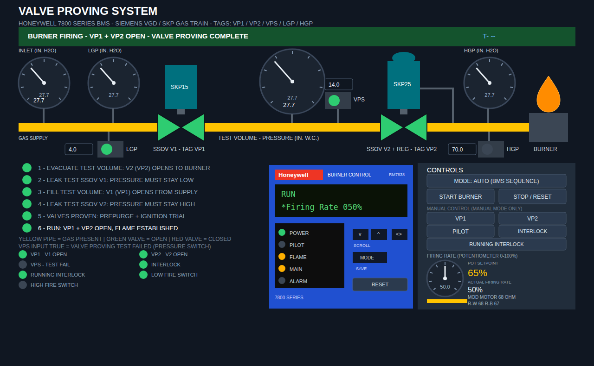

# Newest Optix — Valve Proving Trainer (FactoryTalk Optix)

Honeywell 7800 SERIES valve proving trainer on a Siemens SKP gas train, with a
**burner interlock string**, a **Modutrol mod motor on Series 90 control
(135 ohm R-W-B potentiometer) with high/low fire end-switch proving**, and an
**RM7838-style Honeywell faceplate** with live lights and phase messages.
All pressures are in **inches of water column (in. H2O)**.

Independent project (own GUID and node Ids) — open `ValveProvingNewest.optix`.

## What is different in this version

- **No SIMULATION section** — every drill is done through **MANUAL mode**
  instead. (Failing to drive the mod motor to high/low fire in time in
  MANUAL produces the same prove lockouts the old sim buttons demonstrated.)
- **Manual controls are two per line**: `VP1 | VP2`, `PILOT | INTERLOCK`,
  and the odd one out — **RUNNING INTERLOCK** — spans the full width on the
  bottom row.
- **Input status lights are one aligned grid** of green circles: VP1, VP2,
  VPS, INTERLOCK, RUNNING INTERLOCK, LOW FIRE SWITCH, HIGH FIRE SWITCH.
  The word "CLOSED" is gone — **the green light itself signifies closed**.
- **Firing rate is a potentiometer knob (0–100%)** in the CONTROLS panel,
  where the simulation box used to be, with clean non-overlapping readouts
  beside it:
  - **POT SETPOINT** — where the knob itself is sitting (amber).
  - **ACTUAL FIRING RATE** — where the mod motor really is, plus its
    position in ohms and the R-W / R-B leg resistances.

  The knob responds **live while you drag it** — the rate follows the
  movement immediately rather than waiting for the mouse button to be
  released (the logic subscribes to the widget's value change instead of
  polling). The logic never writes back to the knob, so a drag is never
  fought or snapped back.
- **INLET PRESSURE + / − buttons removed** to make room for the pot. Set
  the supply pressure by **dragging the inlet gauge needle** — it is still
  the one adjustable gauge on the screen.

## Running interlock

`Model/RunningInterlock` is a Boolean input, separate from the safety
interlock string:

- It must be **closed to start** (the START button stays disabled otherwise).
- **If it opens while running, the burner faults**: valves and pilot drop
  out immediately and the banner shows the running-interlock fault.
- **No reset is needed.** It is *not* a latching lockout — the moment the
  running interlock **recloses, the burner restarts by itself** from valve
  proving. No STOP/RESET press, no START press.
- `Model/RunIntlkFault` is a Boolean output that is high while the fault is
  active, for wiring to an alarm.

Contrast with the **safety interlock** (`Model/Interlock`) below, which is a
latching lockout (fault code 19) and *does* require STOP/RESET.

## Burner interlock string

`Model/Interlock` is a Boolean **input** representing the burner interlock
string (limits, airflow switch, high-limit, etc). It is supervised at all
times:

- **Nothing begins unless it is closed.** With the interlock open the
  **START BURNER** button is disabled, the banner reads
  `INTERLOCK OPEN - NOTHING CAN START...`, and the display shows
  `(INTERLOCK OPEN)`. Forcing a start attempt is a **lockout, code 19**.
- **If it opens at any point** during the proving sequence, purge, ignition
  or run, the burner **locks out immediately** (`INTERLOCK OPENED - BURNER
  INTERLOCK STRING BROKE`, code 19) — valves and pilot drop out and only
  STOP/RESET clears it.
- **Status light**: a green circle in the input grid — **green = closed**
  (permissive made), **red = open**. No caption text: the light itself
  signifies closed.
- **Two controls**, as requested:
  - **MANUAL CONTROL ▸ INTERLOCK** — the operator's interlock control,
    enabled in MANUAL mode like VP1/VP2/PILOT.
  - Opening it mid-run from that control drops the string and trips the
    lockout — the drill the old simulation button used to provide.

On a real train, bind `Model/Interlock` to the interlock string input and
drive it from the field wiring instead of the buttons.


*(docs/screen-sample.png — the screen in RUN at 50% firing rate; also
available as SVG. Rendered from this project's layout, so this is what a
working install looks like.)*

The window is **1280x680** so the whole screen — including the Honeywell
module and firing-rate panel at the bottom — fits on a 1366x768 laptop with
the Windows taskbar visible. Native Optix windows do **not** scroll: if a
screen is taller than the monitor, the bottom is simply cut off, which is why
the window is sized to fit.

---

## Getting the project up and running from scratch

### 1. What you need

| Requirement | Notes |
|---|---|
| Windows 10/11 PC | Optix Studio is Windows-only |
| **FactoryTalk Optix Studio** (version 1.4 or newer) | Free from the Rockwell FactoryTalk Hub — create a free account at <https://hub.factorytalk.com>, then install Optix Studio via the FactoryTalk Hub / download page |
| This repository | `main` branch (this project lives at `optix/newest optix/`) |

No PLC, no license dongle, and no separate .NET install are needed — the
built-in emulator runs everything and Studio builds the C# logic itself.

### 2. Get the files

Either clone with git:

```
git clone https://github.com/Jhnblckwood/Boiler-combustion-simulator.git
cd Boiler-combustion-simulator
```

…or on the GitHub page just click **Code ▸ Download ZIP** (this project is on
the default `main` branch — no branch picking needed) and extract it. Keep the
folder structure intact — the project is everything under:

```
optix/newest optix/
```

### 3. Open the project in Optix Studio

1. Start **FactoryTalk Optix Studio**.
2. **Open project** → browse into `optix/newest optix/` and pick
   **`ValveProvingNewest.optix`** (or just double-click that file).
3. First open takes a minute: Studio indexes the model and restores the C#
   solution under `ProjectFiles/NetSolution/` (it regenerates `bin/`, `obj/`
   and the `.references` file — that is normal, they are not in git).

### 4. Build the logic

1. In Studio choose **Build ▸ Build** (or the hammer icon).
2. Watch the Output pane — it must end with a successful build of
   `ValveProvingNewest` / `ValveProvingLogic.cs` with **0 errors**.
3. If the C# panel shows red squiggles right after opening, build anyway —
   references resolve on the first build.

### 5. Run it (emulator)

1. Press **Play** (the runtime/emulator button).
2. The screen opens with the banner **“STANDBY — VALVES CLOSED — READY TO
   START”**, the Honeywell display showing `STANDBY`, and its POWER LED green.
3. **Verify the right build is running** — open the runtime log
   (`FTOptixRuntime.log`, shown in Studio’s output/log pane) and confirm:

   ```
   ValveProvingLogic BUILD v12 started OK
   ```

   If the marker is missing or shows an older version, the runtime is running
   a **stale DLL**: close Studio, delete `ProjectFiles/NetSolution/bin/`,
   `obj/` and `.vs/`, reopen, rebuild, Play again.
4. Optional web client: the project also serves the same screen at
   `http://<your-pc>:8666` (WebPresentationEngine).

### 6. First burner start (AUTO mode)

Everything is simulated — just press buttons and watch:

1. Leave **MODE: AUTO (BMS SEQUENCE)** as is.
2. The **INTERLOCK and RUNNING INTERLOCK start closed** (green lights). In
   MANUAL mode, open either one and START BURNER greys out — nothing can
   begin until both are closed again.
3. The inlet gauge starts at 27.7 in. H2O, so the **LGP is already made**
   (green light, ≥ 4.0 setting). If you drag the inlet gauge below 4, the LGP
   light goes out and starting locks out — that is the point.
4. Press **START BURNER** and watch the sequence:
   - **Steps 1–4** — valve proving: evacuate, V1 hold test, fill, V2 hold
     test. The test-volume gauge and the checklist track each step; the
     Honeywell display reads `VALVE PROVE mm:ss` with `(TEST V1 HOLD)` etc.
   - **Purge** — the mod motor drives toward high fire (watch the ohms climb
     to 135 and the 10 s countdown on the display: `(HI FIRE T-09  67 OHM)`);
     the **HIGH FIRE** switch makes at 130 Ω and only then does the purge
     timer count (`PURGE 00:07`).
   - **Ignition** — the motor drives back to low fire on its own 10 s
     countdown; **LOW FIRE** makes at 5 Ω, the pilot lights (`PILOT IGN
     00:04`, PILOT LED amber, flame signal ~4.2 V).
   - **RUN** — main valves open, burner fires, Honeywell shows `RUN` with
     FLAME + MAIN amber and PILOT off (interrupted pilot, like the real
     RM7838). Drag the **firing-rate pot** to modulate 0–100%.
5. Press **STOP / RESET** (or the faceplate **RESET** button) to shut down.

### 7. Things to try

| Action | Result |
|---|---|
| Drag the **inlet gauge** below the LGP setting mid-run | LGP dropout → `LOCKOUT 17` |
| Raise **inlet + setpoints** so downstream exceeds the HGP setting in run | HGP trip → `LOCKOUT 18` |
| **INTERLOCK** (manual) opened in standby, press START | Start refused; forcing it → `LOCKOUT 19` |
| **RUNNING INTERLOCK** (manual) opened while firing | Burner faults out; **recloses → restarts by itself**, no reset |
| **TOGGLE MODE** → MANUAL, press START BURNER | Training drill: YOU work VP1/VP2/PILOT at each step; a wrong button or a missed window fails the VPS and locks out |
| Drag the **firing-rate pot** in RUN | Modulates the mod motor 0–100%; POT SETPOINT tracks the knob live while dragging, ACTUAL FIRING RATE follows as the motor strokes |
| Drag the **inlet gauge** needle | Sets supply pressure 0–80 in. H2O (replaces the old +/− buttons) |
| Type in the **LGP / HGP / VPS spin boxes** | Numeric-only entry, clamped 0–80 in. H2O |

Every lockout shows the reason in the red banner and as
`LOCKOUT <fault code>` + `(reason)` on the Honeywell display; the ALARM LED
blinks. **STOP/RESET** (or faceplate RESET) clears it.

### 8. Troubleshooting

| Symptom | Cause / fix |
|---|---|
| Every button dead, screen frozen | `Start()` threw — check the log for the full stack trace under `Start FAILED` |
| Same error persists after a “fix” | Stale DLL — confirm the `BUILD v12` marker; if old: close Studio, delete `bin/ obj/ .vs/`, rebuild |
| Gauges stuck at defaults in the designer | Normal — values only move at **runtime** (press Play) |
| `Unable to cast System.String to LocalizedText` in the log | A widget Text property was re-typed as String — see `../CLAUDE.md` (all texts must be LocalizedText) |
| Log error count climbing every 100 ms | A widget property has the wrong DataType; the stack trace names the widget |

---

## How the mod motor works (Series 90, 135 ohm R-W-B)

The firing-rate motor is a **Honeywell Modutrol on Series 90 control**: a
135 ohm potentiometer across the three field wires **R, W, B**. The controller
varies the two legs — **reducing the R-to-W resistance drives the motor
CLOSED (low fire); reducing R-to-B drives it OPEN (high fire)** — and the
motor's feedback wiper reports its actual position in ohms.

| Tag | Meaning |
|-----|---------|
| `Model/ModMotorW` | Resistance R↔W, ohms (command leg — reduced = drive closed) |
| `Model/ModMotorB` | Resistance R↔B, ohms (= 135 − R-W — reduced = drive open) |
| `Model/ModMotorR` | Feedback wiper: actual position, **0 ohm = low fire, 135 ohm = high fire** |
| `Model/LowFireSwitch` | End-switch INPUT — made at/below **5 ohms** |
| `Model/HighFireSwitch` | End-switch INPUT — made at/above **130 ohms** |

The BMS drives the motor itself in both modes:

- **Prepurge at high fire** — after the valves prove, the controller drops
  R-B to 0 (commands 135 ohms) and a **10 second countdown starts**. If the
  HIGH FIRE switch has not proven when it hits zero → **lockout 95**. The
  purge timer only runs at proven high fire.
- **Low fire start** — after purge the controller drops R-W to 0 (commands
  0 ohms) and another **10 second countdown** runs. LOW FIRE switch not
  proven in time → **lockout 96**. The pilot trial waits on low fire.
- **RUN** — released to modulation; the **firing-rate potentiometer**
  (0–100% knob in the CONTROLS panel) commands the position. The panel
  shows firing rate %, mod motor ohms, and the R-W / R-B legs.


## The Honeywell RM7838 faceplate

Drawn from the RM7838B,C manual (66-1094-08, Fig. 10) and the supplied layout
sketch: blue module face, red *Honeywell* logo + BURNER CONTROL header,
full-width two-line VFD, sequence-status LED panel bottom-left, KDM keys and a
**working RESET pushbutton** bottom-right.

LEDs (per the manual’s sequence chart): POWER green, PILOT / FLAME / MAIN
amber, ALARM red blinking on lockout. In RUN the PILOT LED is off — the pilot
is interrupted, exactly like the real module.

Display grammar (line 1 = phase + `mm:ss`; line 2 = `*selectable` or
`(preemptive)` message):

| Phase | Line 1 | Line 2 |
|-------|--------|--------|
| Standby | `STANDBY` | `*Flame Signal  0.0V` (or `(LGP NOT MADE)`) |
| Valve proving | `VALVE PROVE  00:08` | `(TEST V1 HOLD)` etc. |
| Drive to high fire | `PURGE  00:10` | `(HI FIRE T-09  67 OHM)` |
| Purge running | `PURGE  00:07` | `(HI FIRE PROVEN 135 OHM)` |
| Drive to low fire | `PURGE  00:00` | `(LO FIRE T-08  23 OHM)` |
| Pilot trial | `PILOT IGN  00:04` | `*Flame Signal  4.2V` |
| Run | `RUN` | alternates `*Flame Signal 4.2V` / `*Firing Rate 045%` |
| Lockout | `LOCKOUT   95` | `(HIGH FIRE SWITCH NOT PROV)` |

Fault codes: 17 low gas pressure · 18 high gas pressure · **19 interlock
open/opened** · 25 pilot outside trial · 28 pilot flame fail · 55 invalid
control · 56 control changed in run · 57 action not in time · 91 V1 leak ·
92 V2 leak · 95 HF switch not proven · 96 LF switch not proven.

## Gas train and pressure switches

- **Inlet gauge — the only adjustable gauge**: drag its needle (0–80
  in. H2O). Publishes to `Model/SupplyPressure`.
- **LGP gauge + switch** (before SKP15/V1): makes at/above its setting
  (default 4). Start attempt before it makes, or a dropout during the
  sequence/run → lockout.
- **HGP gauge + switch** (after SKP25/V2): sees gas only when V2 passes it;
  must not break — any trip above its setting (default 70) → immediate
  lockout.
- **VPS** setting = allowed differential during each hold test (default 14).
- Setpoints are typed into **numeric spin boxes** (numbers only, 0–80
  enforced by the widget, re-clamped by the logic) and published to the
  `*Setpoint` tags.

## Tags for I/O (Model folder)

| Tag | Type | Meaning |
|-----|------|---------|
| `VP1` / `VP2` | Boolean | Safety shutoff valves open |
| `VPS` | Boolean | Valve proving switch — TRUE = test failed |
| `Pilot` | Boolean | Pilot valve/flame (legal only during the ignition trial) |
| `Lockout` | Boolean | Output — high on any safety lockout |
| `Interlock` | Boolean | Safety interlock string INPUT — TRUE = closed. Nothing starts unless closed; opening at any time **latching lockout** (code 19) |
| `RunningInterlock` | Boolean | Running interlock INPUT — TRUE = closed. Opening faults the burner; **reclosing restarts it automatically, no reset** |
| `RunIntlkFault` | Boolean | Output — high while the running-interlock fault is active |
| `LGP` | Boolean | Low gas pressure switch — TRUE = made |
| `HGP` | Boolean | High gas pressure switch — TRUE = tripped |
| `SupplyPressure` | Float | Inlet gas pressure, in. H2O |
| `DownstreamPressure` | Float | Pressure after V2, in. H2O |
| `ChamberPressure` | Float | Test-volume pressure, in. H2O |
| `LGPSetpoint` / `HGPSetpoint` / `VPSSetpoint` | Float | Trip settings (0–80, defaults 4 / 70 / 14) |
| `ModMotorR` | Float | Mod motor feedback wiper, ohms (0 = low fire, 135 = high fire) |
| `ModMotorW` | Float | Resistance R↔W, ohms — reduced = drive closed |
| `ModMotorB` | Float | Resistance R↔B, ohms — reduced = drive open (135 − R-W) |
| `LowFireSwitch` / `HighFireSwitch` | Boolean | End-switch inputs (≤ 5 Ω / ≥ 130 Ω) |
| `RateSetpoint` | Float | Output — firing-rate potentiometer position, 0–100% |
| `FiringRatePercent` | Float | Output — actual firing rate (mod motor position), 0–100% |
| `FlameSignal` | Float | Flame amplifier signal, VDC |
| `State` / `StateText` | Int32 / String | Sequence state + banner text |
| `AutoMode` | Boolean | AUTO (BMS sequence) / MANUAL (operator drill) |

## Connecting a real gas train instead of the simulation

All simulation lives in `ProjectFiles/NetSolution/ValveProvingLogic.cs`:

1. Bind `SupplyPressure` (transmitter), `Interlock` (interlock string),
   `LGP`, `HGP` (switches), `ModMotorR` / `ModMotorW` / `ModMotorB`
   (135 ohm Series 90 bus) and `LowFireSwitch` / `HighFireSwitch` (end
   switches) to your controller tags via an Optix CommDriver.
2. Delete `SimulateActuator()` and the two lines in
   `UpdateGasPressureSwitches()` that compute `LGP`/`HGP` from pressure.
3. `VP1`, `VP2`, `Pilot`, `Lockout` are outputs — wire them out the same way.
4. Remove the leak / pilot-fail / actuator-fault sim buttons at will.

## Folder map

```
ValveProvingNewest.optix          project root (open this)
ValveProvingNewest.optix.design   Studio design companion
Nodes/                               the information model (YAML)
  UI/UI.yaml                         every widget on the screen
  Model/Model.yaml                   the tag table above
  NetLogic/, Alarms/, ...            remaining categories
ProjectFiles/NetSolution/            C# solution
  ValveProvingLogic.cs               sequence + all animation (BUILD v12)
docs/screen-sample.png|.svg          what the running screen looks like
```

### Notes for editing the project files by hand

These projects are hand-authored YAML, so a few rules matter:

- Label / Button / TextBox text is **`LocalizedText`**, never `String` —
  from C# assign `widget.LocalizedText = new LocalizedText(string.Empty,
  text, "en-US")`. A raw string assignment throws on every 100 ms scan and
  makes the whole screen look frozen.
- SpinBox `Value` / `MinValue` / `MaxValue` must be **`Double`** (not
  Float), and `CircularGauge.Value` is **`Float`**. Gauges are draggable
  unless you set `Editable: false`.
- Widgets are driven **by name** from `ValveProvingLogic.cs`, so keep
  widget names stable when rearranging the screen.
- If a fix does not seem to take effect, check the `BUILD vN` marker in the
  log — Studio keeps running the previously compiled assembly when a build
  fails (delete `bin/ obj/ .vs/` and rebuild).
