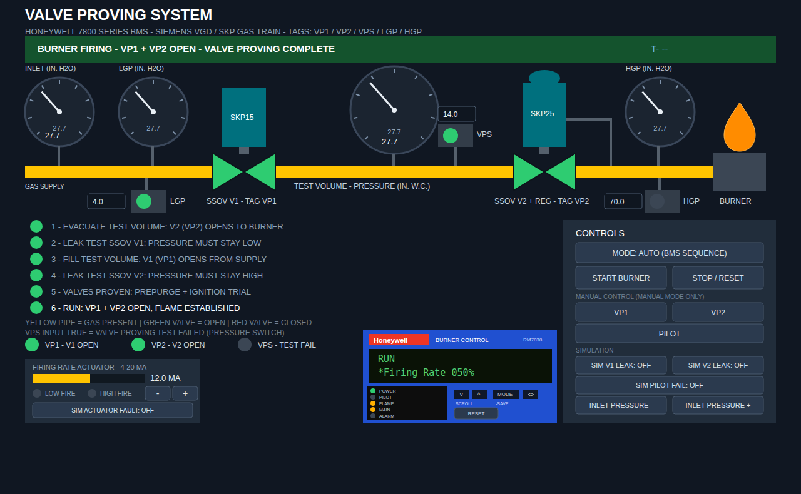

# Valve Proving Honeywell — FactoryTalk Optix Project

Honeywell 7800 SERIES valve proving trainer on a Siemens SKP gas train, with a
**4-20 mA firing-rate actuator (high/low fire switch proving)** and an
**RM7838-style Honeywell faceplate** with live lights and phase messages.
All pressures are in **inches of water column (in. H2O)**.


*(docs/screen-sample.png — the screen in RUN at 50% firing rate; also
available as SVG. Rendered from this project's layout, so this is what a
working install looks like.)*

The window is **1280x680** so the whole screen — including the Honeywell
module and firing-rate panel at the bottom — fits on a 1366x768 laptop with
the Windows taskbar visible. Native Optix windows do **not** scroll: if a
screen is taller than the monitor, the bottom is simply cut off, which is why
the window is sized to fit.

---

## Getting the project up and running from scratch

### 1. What you need

| Requirement | Notes |
|---|---|
| Windows 10/11 PC | Optix Studio is Windows-only |
| **FactoryTalk Optix Studio** (version 1.4 or newer) | Free from the Rockwell FactoryTalk Hub — create a free account at <https://hub.factorytalk.com>, then install Optix Studio via the FactoryTalk Hub / download page |
| This repository | Branch `claude/optix-valve-proving-screen-o9nh80` |

No PLC, no license dongle, and no separate .NET install are needed — the
built-in emulator runs everything and Studio builds the C# logic itself.

### 2. Get the files

Either clone with git:

```
git clone https://github.com/Jhnblckwood/Boiler-combustion-simulator.git
cd Boiler-combustion-simulator
git checkout claude/optix-valve-proving-screen-o9nh80
```

…or on the GitHub page pick the branch `claude/optix-valve-proving-screen-o9nh80`
→ **Code ▸ Download ZIP** and extract it. Keep the folder structure intact —
the project is everything under:

```
optix/valve proving honeywell/
```

### 3. Open the project in Optix Studio

1. Start **FactoryTalk Optix Studio**.
2. **Open project** → browse into `optix/valve proving honeywell/` and pick
   **`ValveProvingHoneywell.optix`** (or just double-click that file).
3. First open takes a minute: Studio indexes the model and restores the C#
   solution under `ProjectFiles/NetSolution/` (it regenerates `bin/`, `obj/`
   and the `.references` file — that is normal, they are not in git).

### 4. Build the logic

1. In Studio choose **Build ▸ Build** (or the hammer icon).
2. Watch the Output pane — it must end with a successful build of
   `ValveProvingHoneywell` / `ValveProvingLogic.cs` with **0 errors**.
3. If the C# panel shows red squiggles right after opening, build anyway —
   references resolve on the first build.

### 5. Run it (emulator)

1. Press **Play** (the runtime/emulator button).
2. The screen opens with the banner **“STANDBY — VALVES CLOSED — READY TO
   START”**, the Honeywell display showing `STANDBY`, and its POWER LED green.
3. **Verify the right build is running** — open the runtime log
   (`FTOptixRuntime.log`, shown in Studio’s output/log pane) and confirm:

   ```
   ValveProvingLogic BUILD v8 started OK
   ```

   If the marker is missing or shows an older version, the runtime is running
   a **stale DLL**: close Studio, delete `ProjectFiles/NetSolution/bin/`,
   `obj/` and `.vs/`, reopen, rebuild, Play again.
4. Optional web client: the project also serves the same screen at
   `http://<your-pc>:8666` (WebPresentationEngine).

### 6. First burner start (AUTO mode)

Everything is simulated — just press buttons and watch:

1. Leave **MODE: AUTO (BMS SEQUENCE)** as is.
2. The inlet gauge starts at 27.7 in. H2O, so the **LGP is already made**
   (green light, ≥ 4.0 setting). If you drag the inlet gauge below 4, the LGP
   light goes out and starting locks out — that is the point.
3. Press **START BURNER** and watch the sequence:
   - **Steps 1–4** — valve proving: evacuate, V1 hold test, fill, V2 hold
     test. The test-volume gauge and the checklist track each step; the
     Honeywell display reads `VALVE PROVE mm:ss` with `(TEST V1 HOLD)` etc.
   - **Purge** — the firing-rate bar ramps 4 → 20 mA
     (`(DRIVE HI FIRE 12.4MA)`), the **HIGH FIRE** light makes at 19.5 mA,
     and only then does the purge timer count (`PURGE 00:07`).
   - **Ignition** — the actuator ramps back to 4 mA, **LOW FIRE** makes, the
     pilot lights (`PILOT IGN 00:04`, PILOT LED amber, flame signal ~4.2 V).
   - **RUN** — main valves open, burner fires, Honeywell shows `RUN` with
     FLAME + MAIN amber and PILOT off (interrupted pilot, like the real
     RM7838). Use **RATE − / RATE +** to modulate 4–20 mA.
4. Press **STOP / RESET** (or the faceplate **RESET** button) to shut down.

### 7. Things to try

| Action | Result |
|---|---|
| **SIM V1 LEAK: ON**, then start | V1 hold test fails → `LOCKOUT 91` |
| **SIM V2 LEAK: ON**, then start | V2 hold test fails → `LOCKOUT 92` |
| **SIM PILOT FAIL: ON**, then start | Pilot trial fails → `LOCKOUT 28` |
| **SIM ACTUATOR FAULT: ON**, then start | Actuator freezes, high-fire never proves → `LOCKOUT 95` (turn it on during ignition drive-down instead → `LOCKOUT 96`) |
| Drag the **inlet gauge** below the LGP setting mid-run | LGP dropout → `LOCKOUT 17` |
| Raise **inlet + setpoints** so downstream exceeds the HGP setting in run | HGP trip → `LOCKOUT 18` |
| **TOGGLE MODE** → MANUAL, press START BURNER | Training drill: YOU work VP1/VP2/PILOT at each step; a wrong button or a missed window fails the VPS and locks out |
| Type in the **LGP / HGP / VPS spin boxes** | Numeric-only entry, clamped 0–80 in. H2O |

Every lockout shows the reason in the red banner and as
`LOCKOUT <fault code>` + `(reason)` on the Honeywell display; the ALARM LED
blinks. **STOP/RESET** (or faceplate RESET) clears it.

### 8. Troubleshooting

| Symptom | Cause / fix |
|---|---|
| Every button dead, screen frozen | `Start()` threw — check the log for the full stack trace under `Start FAILED` |
| Same error persists after a “fix” | Stale DLL — confirm the `BUILD v8` marker; if old: close Studio, delete `bin/ obj/ .vs/`, rebuild |
| Gauges stuck at defaults in the designer | Normal — values only move at **runtime** (press Play) |
| `Unable to cast System.String to LocalizedText` in the log | A widget Text property was re-typed as String — see `../CLAUDE.md` (all texts must be LocalizedText) |
| Log error count climbing every 100 ms | A widget property has the wrong DataType; the stack trace names the widget |

---

## How the firing-rate supervision works (4-20 mA)

`Model/FiringRateMA` is the mod-motor position feedback: **4 mA = LOW FIRE**
(`Model/LowFireSwitch` made at/below 4.5 mA), **20 mA = HIGH FIRE**
(`Model/HighFireSwitch` made at/above 19.5 mA). The BMS drives the actuator
itself in both modes, like the RM7838 does through its firing-rate terminals:

- **Prepurge at high fire** — after the valves prove, the actuator drives to
  20 mA; the purge timer **only runs while HIGH FIRE is proven**. No prove
  inside the window → lockout 95.
- **Low fire start** — after purge the actuator returns to 4 mA; the pilot
  trial **waits on LOW FIRE**. No prove → lockout 96.
- **RUN** — released to modulation; **RATE − / +** move the target in 2 mA
  steps (enabled only in RUN).
- The real RM7838 allows **4 min 15 s** for each switch to close; the sim
  uses **15 s** (`ProveWindow` in `ValveProvingLogic.cs`) so drills stay quick.

## The Honeywell RM7838 faceplate

Drawn from the RM7838B,C manual (66-1094-08, Fig. 10) and the supplied layout
sketch: blue module face, red *Honeywell* logo + BURNER CONTROL header,
full-width two-line VFD, sequence-status LED panel bottom-left, KDM keys and a
**working RESET pushbutton** bottom-right.

LEDs (per the manual’s sequence chart): POWER green, PILOT / FLAME / MAIN
amber, ALARM red blinking on lockout. In RUN the PILOT LED is off — the pilot
is interrupted, exactly like the real module.

Display grammar (line 1 = phase + `mm:ss`; line 2 = `*selectable` or
`(preemptive)` message):

| Phase | Line 1 | Line 2 |
|-------|--------|--------|
| Standby | `STANDBY` | `*Flame Signal  0.0V` (or `(LGP NOT MADE)`) |
| Valve proving | `VALVE PROVE  00:08` | `(TEST V1 HOLD)` etc. |
| Drive to high fire | `PURGE  00:10` | `(DRIVE HI FIRE 12.4MA)` |
| Purge running | `PURGE  00:07` | `(HI FIRE PROVEN 20.0MA)` |
| Drive to low fire | `PURGE  00:00` | `(DRIVE LO FIRE 8.6MA)` |
| Pilot trial | `PILOT IGN  00:04` | `*Flame Signal  4.2V` |
| Run | `RUN` | alternates `*Flame Signal 4.2V` / `*Firing Rate 045%` |
| Lockout | `LOCKOUT   95` | `(HIGH FIRE SWITCH NOT PROV)` |

Fault codes: 17 low gas pressure · 18 high gas pressure · 25 pilot outside
trial · 28 pilot flame fail · 55 invalid control · 56 control changed in run ·
57 action not in time · 91 V1 leak · 92 V2 leak · 95 HF switch not proven ·
96 LF switch not proven.

## Gas train and pressure switches

- **Inlet gauge — the only adjustable gauge**: drag its needle or use
  **INLET PRESSURE + / −** (2 in. steps, 0–80). Publishes to
  `Model/SupplyPressure`.
- **LGP gauge + switch** (before SKP15/V1): makes at/above its setting
  (default 4). Start attempt before it makes, or a dropout during the
  sequence/run → lockout.
- **HGP gauge + switch** (after SKP25/V2): sees gas only when V2 passes it;
  must not break — any trip above its setting (default 70) → immediate
  lockout.
- **VPS** setting = allowed differential during each hold test (default 14).
- Setpoints are typed into **numeric spin boxes** (numbers only, 0–80
  enforced by the widget, re-clamped by the logic) and published to the
  `*Setpoint` tags.

## Tags for I/O (Model folder)

| Tag | Type | Meaning |
|-----|------|---------|
| `VP1` / `VP2` | Boolean | Safety shutoff valves open |
| `VPS` | Boolean | Valve proving switch — TRUE = test failed |
| `Pilot` | Boolean | Pilot valve/flame (legal only during the ignition trial) |
| `Lockout` | Boolean | Output — high on any safety lockout |
| `LGP` | Boolean | Low gas pressure switch — TRUE = made |
| `HGP` | Boolean | High gas pressure switch — TRUE = tripped |
| `SupplyPressure` | Float | Inlet gas pressure, in. H2O |
| `DownstreamPressure` | Float | Pressure after V2, in. H2O |
| `ChamberPressure` | Float | Test-volume pressure, in. H2O |
| `LGPSetpoint` / `HGPSetpoint` / `VPSSetpoint` | Float | Trip settings (0–80, defaults 4 / 70 / 14) |
| `FiringRateMA` | Float | Firing-rate actuator feedback, 4–20 mA |
| `LowFireSwitch` / `HighFireSwitch` | Boolean | Firing-rate end switches |
| `ActuatorFault` | Boolean | Sim: freeze the mA feedback |
| `FlameSignal` | Float | Flame amplifier signal, VDC |
| `State` / `StateText` | Int32 / String | Sequence state + banner text |
| `AutoMode`, `LeakV1`, `LeakV2`, `PilotFail` | Boolean | Mode + simulation toggles |

## Connecting a real gas train instead of the simulation

All simulation lives in `ProjectFiles/NetSolution/ValveProvingLogic.cs`:

1. Bind `SupplyPressure` (transmitter), `LGP`, `HGP` (switches),
   `FiringRateMA` (4-20 mA analog input) and `LowFireSwitch` /
   `HighFireSwitch` (end switches) to your controller tags via an Optix
   CommDriver.
2. Delete `SimulateActuator()` and the two lines in
   `UpdateGasPressureSwitches()` that compute `LGP`/`HGP` from pressure.
3. `VP1`, `VP2`, `Pilot`, `Lockout` are outputs — wire them out the same way.
4. Remove the leak / pilot-fail / actuator-fault sim buttons at will.

## Folder map

```
ValveProvingHoneywell.optix          project root (open this)
ValveProvingHoneywell.optix.design   Studio design companion
Nodes/                               the information model (YAML)
  UI/UI.yaml                         every widget on the screen
  Model/Model.yaml                   the tag table above
  NetLogic/, Alarms/, ...            remaining categories
ProjectFiles/NetSolution/            C# solution
  ValveProvingLogic.cs               sequence + all animation (BUILD v8)
docs/screen-sample.png|.svg          what the running screen looks like
```

See `../CLAUDE.md` for the hand-authoring rules this project follows
(LocalizedText, SpinBox datatypes, stale-DLL playbook, validation checklist).
